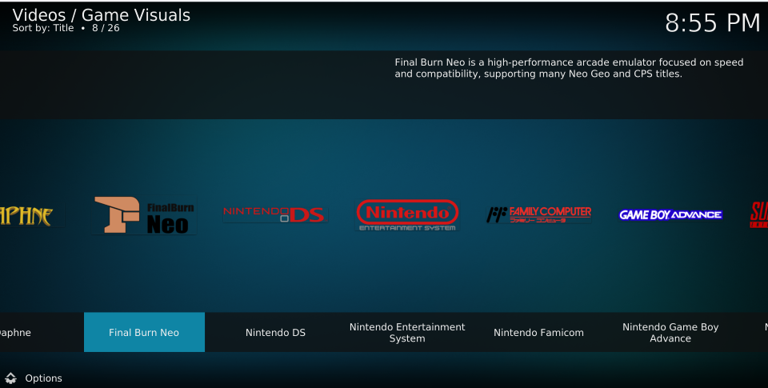
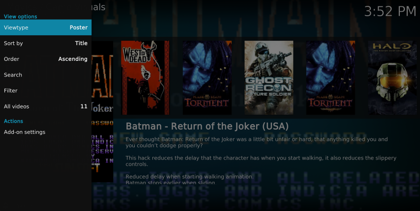

# Game Visuals (游戏画廊)

[中文文档](docs/README_zh.md)

A game visualization add-on for Kodi.

## Motivation

While using Kodi as a home entertainment center, I found that it lacked an add-on dedicated to browsing and showcasing game-related visual resources. Although Kodi natively supports various types of media, its management and presentation of game visuals are not very well-developed. Therefore, I decided to create this add-on to provide users with an intuitive and easy-to-use interface for browsing and displaying their game visuals, such as screenshots, titles, and descriptions.

## Features

* Supports direct use of EmulationStation’s **gamelist.xml** file without extra configuration.
* Automatically detects games in ROM folders and displays the corresponding visual resources.
* Thanks to Kodi’s view-switching functionality, it offers multiple view modes so users can choose their preferred browsing style. Click the **Options** button in the bottom-left corner and select a **Viewtype** mode from the popup menu.

## Known Issues

- **Preview Videos:** Cannot be played due to limitations in Kodi’s layout files, which do not provide a dedicated area for video previews.

- **ZIP SNES ROMs:** SNES ROMs compressed in .zip format cannot be launched directly. Kodi’s built-in RetroPlayer treats zipped ROMs as arcade ROMs, so they must be extracted before use.

## License

This project is licensed under the MIT License - see the [LICENSE](LICENSE) file for details.

## Support
If you find this add-on useful and would like to support its development, please consider making a donation. Your support is greatly appreciated!

If you encounter any issues or have suggestions for improvement, please feel free to open an issue on the [GitHub repository](https://github.com/yunnysunny/game-visuals).

## TODO
- [ ] Add support for multiple root path for roms.
- [ ] Improve compatibility with zipped ROMs.

