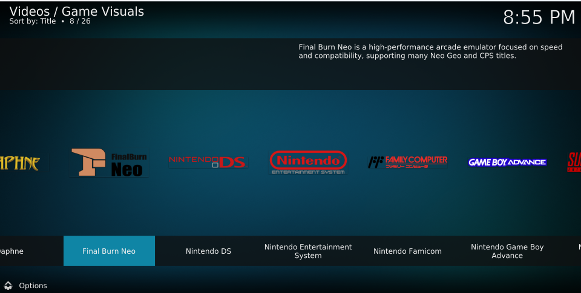

# Game Visuals(游戏画廊)
一个 Kodi 下的游戏可视化插件。

## 开发初衷
在使用 Kodi 作为家庭娱乐中心时，我发现缺少一个专门用于浏览和展示游戏相关视觉资源的插件。虽然 Kodi 本身支持多种媒体类型，但对于游戏视觉资源的管理和展示并不完善。因此，我决定开发这个插件，旨在为用户提供一个直观、易用的界面来浏览和展示他们的游戏视觉资源，如游戏截图、名称、简介等。

## 功能特点
- 支持直接使用 EmulationStation 的 gamelist.xml 文件，无需额外配置，详见 [这里](wiki/zh/gamelist-usage.md)。
- 自动识别 ROM 文件夹中的游戏，并显示相关视觉资源。
- 借助于 Kodi 的视图切换功能，可以提供多种视图模式，用户可以根据喜好选择不同的浏览方式。点击左下角 **选项** 按钮，在弹出的菜单中选择 **视图类型** 模式。

## 已知问题
- 无法播放预览视频，由于 Koid 布局文件中的限制，没有区域可以显示预览视频。
- 无法运行 zip 格式的 snes ROM 文件，Kodi 内置的 RetroPlayer 将 zip 文件中的 ROM 视作街机游戏 ROM，必须将其解压才能识别。

## 许可协议

本项目采用 **MIT 许可** - 详情请参阅 [LICENSE](LICENSE) 文件。

## 支持

如果你觉得这个插件有用，并希望支持其开发，请考虑捐助。你的支持将非常感谢！

如果你在使用过程中遇到任何问题，或有改进建议，请随时在 [GitHub 仓库](https://github.com/yunnysunny/game-visuals) 上提交 issue。

