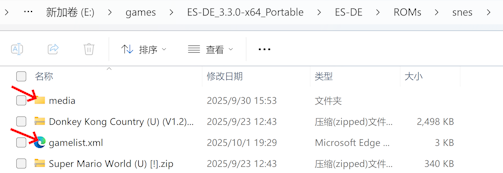

# Using gamelist.xml

## Basic Usage

In order for this plugin to correctly display game information, a **gamelist.xml** file must be placed inside the ROM directory of each gaming platform.
This plugin does not have an automatic scraping feature, so you need to scrape game metadata on your PC first, and then copy it to the device running Kodi.

It is recommended to use [Skraper](https://www.skraper.net/) to scrape game assets. After downloading and launching it, you’ll see the initialization panel. We recommend registering and logging into the **ScreenScraper** website to gain a higher daily scraping quota:

Click **Next**, then choose **RecalBox** as the game frontend:

Next, select the root directory of your ROMS. This folder should contain subdirectories for each platform’s ROM files:

After selecting the folder, click **Next**. A prompt will appear asking where to save the scraped media files:

At this point, the initialization process is complete, and the main interface will pop up. The **MEDIA** tab in the main interface can be used to configure image types:

By default, you can set two images, which correspond to the `image` and `thumbnail` tags in the XML file. It is recommended to use a horizontal image for the first one and a vertical image for the second. To select them, click on the sample image, then set the **Media Type** with the main category as **IMAGE**. For the subcategory, you can choose from options such as `FANART`, `BOX2D`, `TITLE SCREENSHOT`, or `SCREENSHOT`. Among these, `BOX2D` refers to the vertical image.

In the lower-right corner of the main interface, there is a play-like start button. Click it to begin scraping.

Since information for all platforms needs to be scraped, a confirmation dialog will pop up after clicking start, reminding you that the process may take some time. Simply click **OK** to continue:

During the scraping process, you’ll see a progress bar:

When scraping is complete, a sound will play and the button in the lower right corner will change to a checkmark (√):

At this point, if you open any of the scraped platform directories, you’ll see a new **gamelist.xml** file along with a **media** folder.

