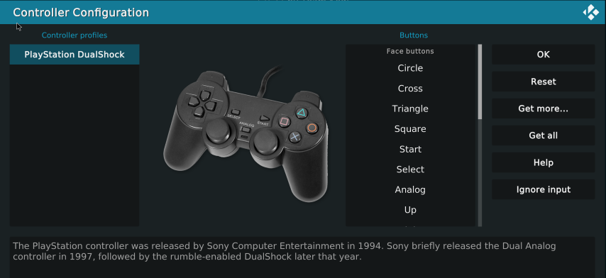

# How to Add Game Controller in Kodi
Go to `Settings` -> `Add-ons` -> `Install from repository` -> `Game add-ons` -> `Controller profiles` to open a list of game console controllers. Find the option that matches your controller, such as the one shown below, and click Install.

After installation, click the `Configuration` button of the add-on, and the following window will pop up:

When the window pops up, it will default to setting the `Circle` button. After clicking the specific button on your controller, it will prompt you to set the `Cross` button, and so on. After completing the setup, click the Save button. If during the setup process, your controller doesn't have a corresponding button for a certain key, you can long-press any key to skip.

After completing the setup, click `Save`.

