# Game Visuals User Manual

Game Visuals is a Kodi video add-on. It reads the `gamelist.xml` in your ROM folders, shows each game's cover, screenshot, description and trailer, and launches games with Kodi's built-in RetroPlayer.

The screenshots in this manual were taken on Kodi 21 for Windows with the default Estuary skin and the interface language set to English.

- [Before you start](#before-you-start)
- [Adding game folders](#adding-game-folders)
- [Add-on settings](#add-on-settings)
- [Kodi default list](#kodi-default-list)
- [Game details](#game-details)
- [Custom browse layouts](#custom-browse-layouts)
- [Adding trailers](#adding-trailers)
- [Games without artwork](#games-without-artwork)
- [Launching games and emulators](#launching-games-and-emulators)
- [FAQ](#faq)

## Before you start

1. **Kodi 19 or later.** Games run in Kodi's built-in RetroPlayer.
2. **Emulator cores.** The first time you launch a game for a platform, Kodi asks you to pick and install an emulator core (`game.libretro.*`). See [Launching games and emulators](#launching-games-and-emulators).
3. **gamelist.xml.** The add-on does not scrape game information itself. Generate `gamelist.xml` together with the image and video files using a tool such as Skraper, then put them in your ROM folders. See [Using gamelist.xml](gamelist-usage.md).
4. **A game controller** (optional). See [How to Add Game Controller in Kodi](how-add-joystick.md).

## Adding game folders

From the Kodi home screen, open **Add-ons → Video add-ons → Game Visuals**. The start page lists the game folders you have added:

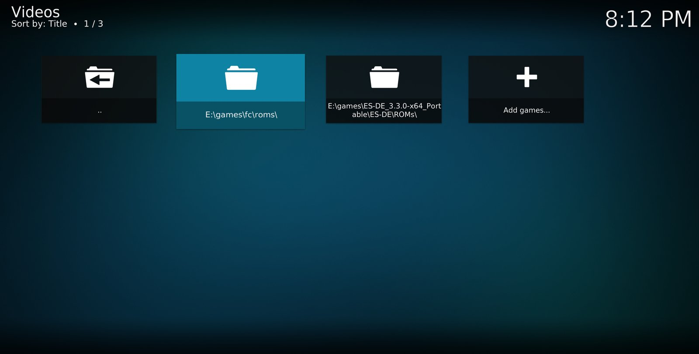

- **Add a folder:** select **Add games...** and choose a ROM folder in the file browser. You can add as many folders as you like.
- **Remove a folder:** open the context menu on the folder (`C` on a keyboard, Menu on a remote) and select **Remove**.
- **Folder structure:** you can add a single platform's ROM folder, such as `E:\games\fc\roms`, or a root folder that contains one sub-folder per platform, such as the ES-DE `ROMs` folder. Sub-folders named after a platform (`nes`, `snes`, `megadrive`, ...) are shown with the platform's full name and logo.

## Add-on settings

On Kodi's **Add-ons** screen, select Game Visuals, open the context menu and choose **Settings**.

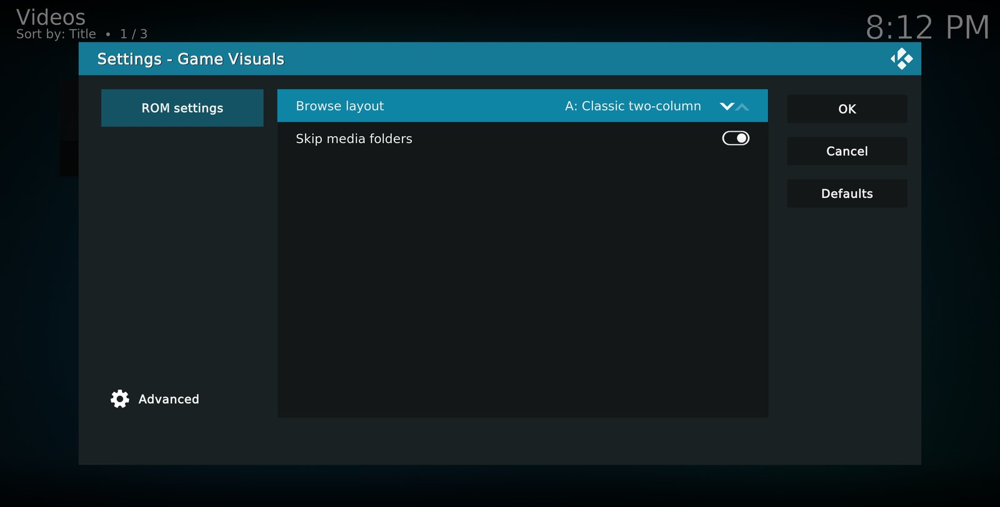

| Setting | Description |
|---|---|
| Browse layout | The screen used when you open a game folder: **Kodi default list**, **A: Classic two-column**, **B: Immersive hero**, **C: Poster wall** or **D: Retro TV**. See below. The default is Kodi default list. |
| Skip media folders | Hides artwork folders such as `images`, `videos` and `media` from the game list. Keep this on. |

## Kodi default list

With **Browse layout** set to **Kodi default list**, game folders are shown with the views provided by your Kodi skin. Use **Options → Viewtype** in the bottom-left corner to switch between list, wall and other views.

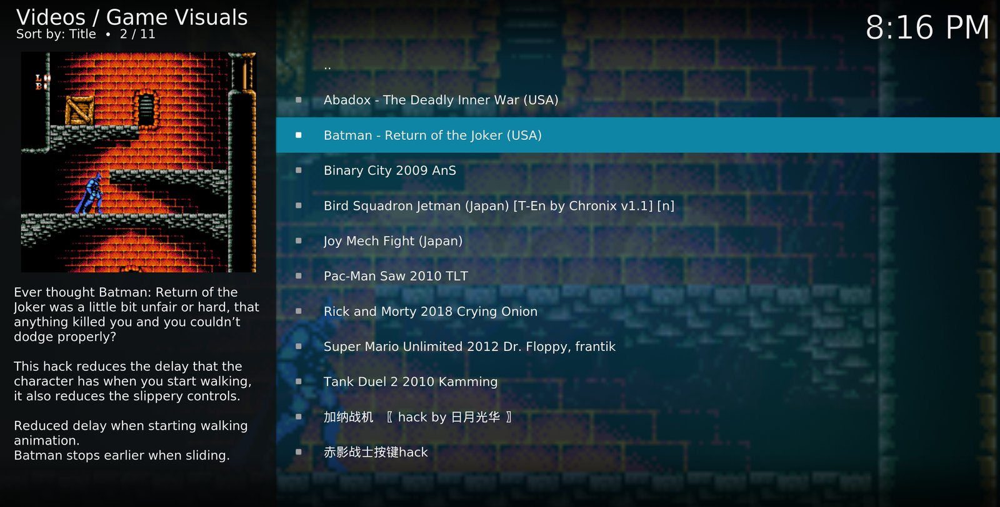

- **Play a game:** select it and press OK.
- **Show details:** open the context menu on a game and select **Game details** to open the add-on's [Game details](#game-details) screen.

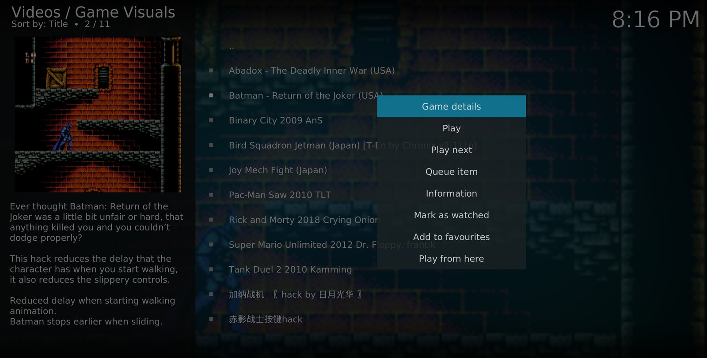

> Pressing `I` (Info) in the default list opens Kodi's own information screen, not the add-on's Game details screen. Use the context menu instead.

## Game details

The details screen shows everything about one game:

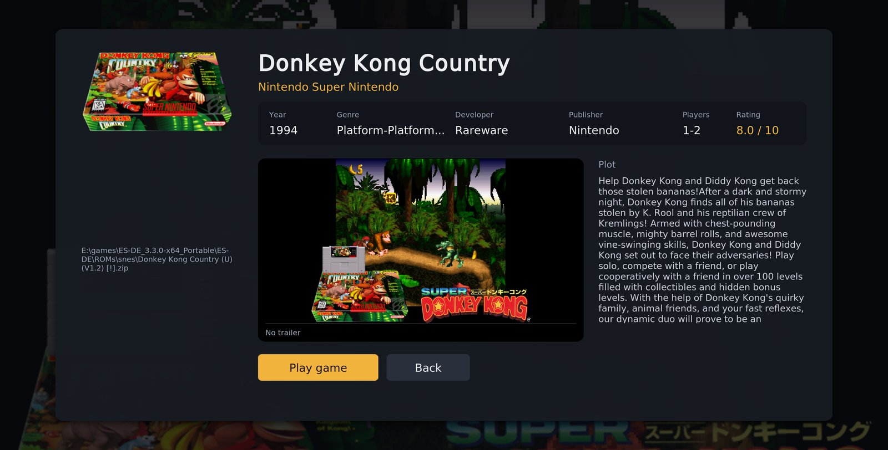

- **Left:** the cover and the ROM file path.
- **Below the title:** the platform name, plus year, genre, developer, publisher, players and rating. Fields missing from `gamelist.xml` are hidden; if none are present, "No more details" is shown.
- **Middle:** the trailer area. If the game has a trailer, it plays automatically with its progress shown underneath; otherwise the screenshot is shown.
- **Right:** the game description, which scrolls automatically when it is long.
- **Buttons:**
  - **Play game:** stops the trailer and launches the game.
  - **Fullscreen trailer:** plays the trailer full screen; press Back to return. Only shown for games with a trailer.
  - **Back:** closes the screen.

For games with a trailer, playback starts as soon as the screen opens:

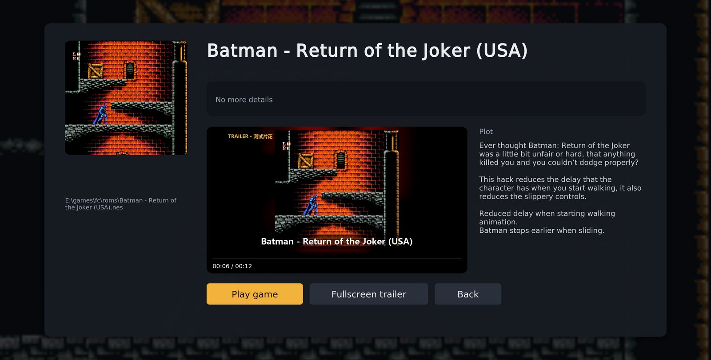

## Custom browse layouts

When **Browse layout** is set to one of A–D, opening a game folder from the add-on's start page shows that full-screen layout. All four layouts work the same way:

| Key (keyboard / remote) | Action |
|---|---|
| Arrow keys | Select a game or folder |
| `Enter` / OK | Open a folder or play a game |
| `I` / Info, `C` / Menu | Open [Game details](#game-details) |
| `Backspace`, `Esc` / Back | Go up one folder; close the layout at the top level |

When a game with a trailer stays selected for about 1.5 seconds, its trailer plays in the layout's video area. It stops when you move to another game, open the details screen or start a game.

### A: Classic two-column

The game list is on the left. On the right are the trailer or screenshot, then the cover, title, tags and description. Good for large folders you want to scan quickly.

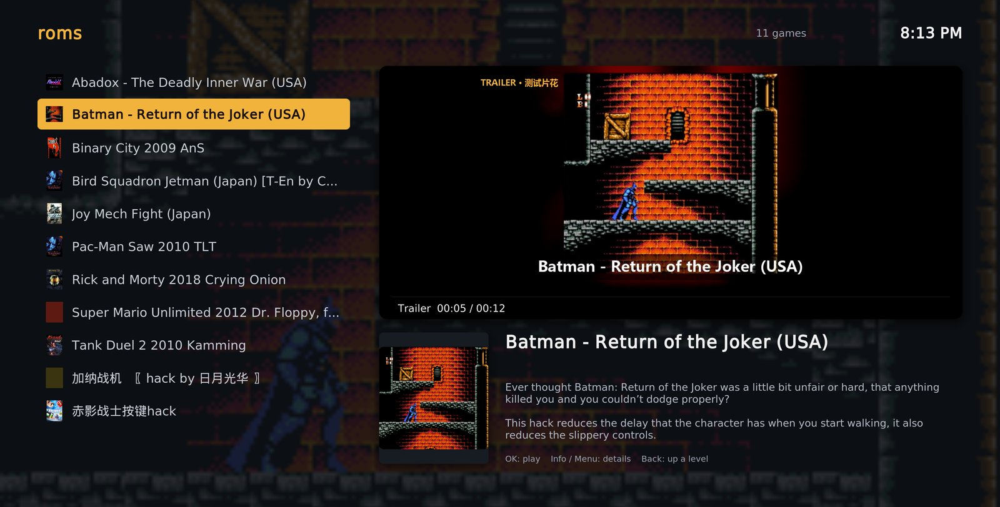

Year, genre, developer, players and rating from `gamelist.xml` are shown as tags under the title, with the rating highlighted:

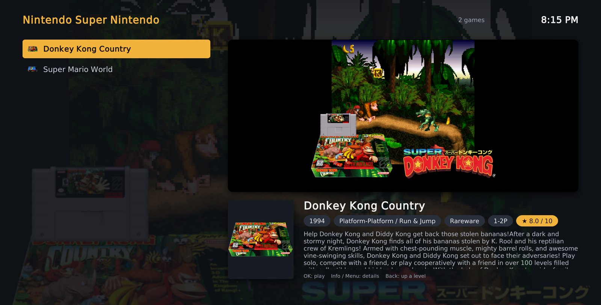

### B: Immersive hero

The selected game's screenshot fills the background, with a large title and description on the left, the trailer in the top-right corner and a scrolling cover carousel along the bottom. Designed for TVs.

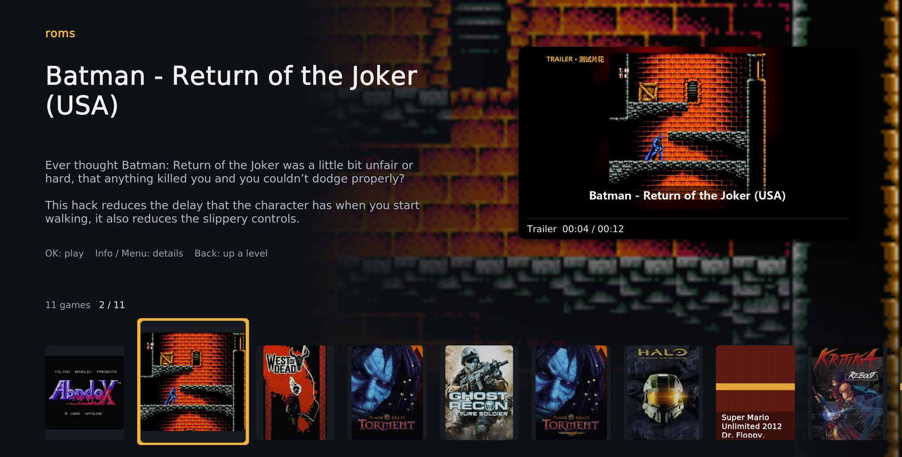

### C: Poster wall

A grid of seven covers per row; move around with the arrow keys. The info bar at the bottom shows the selected game's trailer, title and description. Works best when every game has a cover.

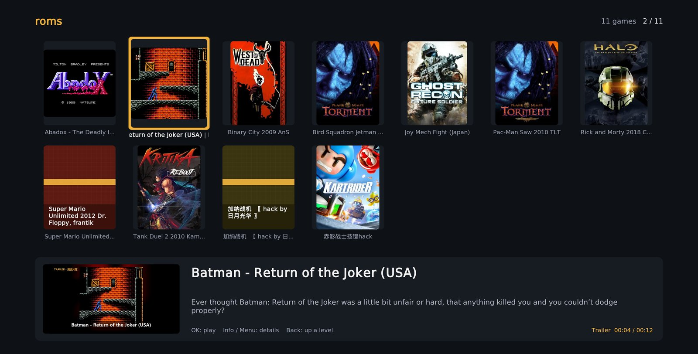

### D: Retro TV

Trailers and screenshots play on the screen of a retro TV with scanlines, and the game list on the right is styled as cartridges.

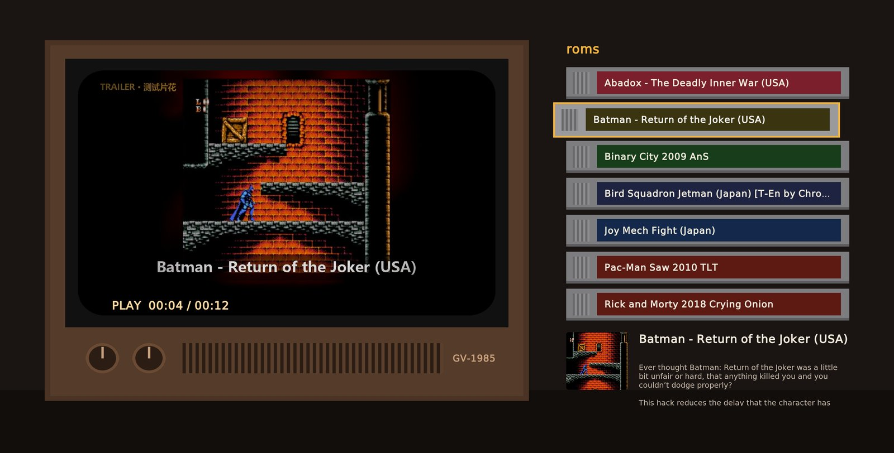

### Browsing multi-platform folders

If you added a root folder that contains one sub-folder per platform, the layout first lists the platform folders with their logos and descriptions. Press OK to open a folder and Back to go up again.

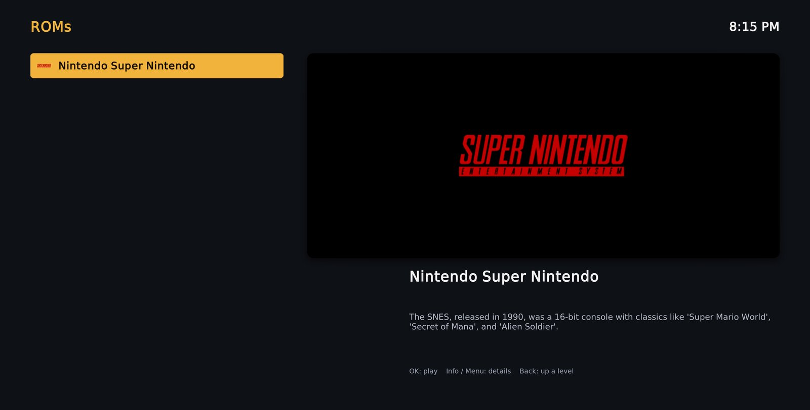

## Adding trailers

A trailer is set with the `<video>` tag of each `<game>` in `gamelist.xml`. Paths are relative to the folder containing `gamelist.xml`. These are all the tags the add-on reads:

```xml
<game>
    <path>./Donkey Kong Country (U) (V1.2) [!].zip</path>
    <name>Donkey Kong Country</name>
    <desc>Game description...</desc>
    <image>./media/images/Donkey Kong Country (U) (V1.2) [!].png</image>       <!-- screenshot, used as background -->
    <thumbnail>./media/box3d/Donkey Kong Country (U) (V1.2) [!].png</thumbnail> <!-- cover -->
    <video>./videos/Donkey Kong Country (U) (V1.2) [!].mp4</video>              <!-- trailer -->
    <releasedate>19941125T000000</releasedate>  <!-- the first 4 digits are used as the year -->
    <genre>Platform</genre>
    <developer>Rareware</developer>
    <publisher>Nintendo</publisher>
    <players>1-2</players>
    <rating>0.8</rating>                        <!-- 0 to 1, shown as 8.0 / 10 -->
</game>
```

- Any video format Kodi can play works; MP4 (H.264) is recommended.
- Put trailers in a `videos` folder inside the ROM folder. With **Skip media folders** on, that folder does not appear in the game list.
- If the file referenced by `<video>` does not exist, the game is treated as having no trailer.

## Games without artwork

If a game has neither a cover nor a screenshot in `gamelist.xml`, the add-on shows a colored card with the game's name in place of the cover. The card color is the same for that game in every layout and on the details screen. The screenshot area shows "No screenshot", or "NO SIGNAL" in the Retro TV layout.

In the layout C screenshot above, Super Mario Unlimited and 加纳战机 in the second row are shown this way.

## Launching games and emulators

The first time you launch a game for a platform, Kodi shows a dialog for choosing an emulator, listing every core that supports the file type. Cores that are already installed are marked and can be used right away; choosing one that is not installed makes Kodi download and install it first.

For FC / NES games, **Nestopia** or **FCEUmm** is recommended.

## FAQ

**Installing an emulator core fails**

If `kodi.log` shows a 404 error for the download, Kodi's local copy of the add-on repository index is out of date and points to an old version that has been removed from the official mirror. Go to **Add-ons → Install from repository → Kodi Add-on repository**, open the context menu on the repository, choose **Check for updates**, then install again.

**Kodi crashes after a game starts**

The emulator core is usually incompatible with the ROM. For example, the old bnes core crashes on some homebrew games. Find the problem core under the game add-ons in **Add-ons → My add-ons**, uninstall it and use a different core.

**The top of the screen shows the folder name instead of the platform name**

The platform is detected from the folder name. Name your ROM folders after the EmulationStation platform folders (for example `nes`, `snes`, `megadrive`) to get the full platform name.

**The trailer does not play**

- Check that the `<video>` path is correct and the file exists.
- Keep the game selected for more than a second.
- Check that the video plays in Kodi on its own.

**Some text is blank after updating the add-on**

New interface text in the add-on is loaded only after Kodi restarts.
