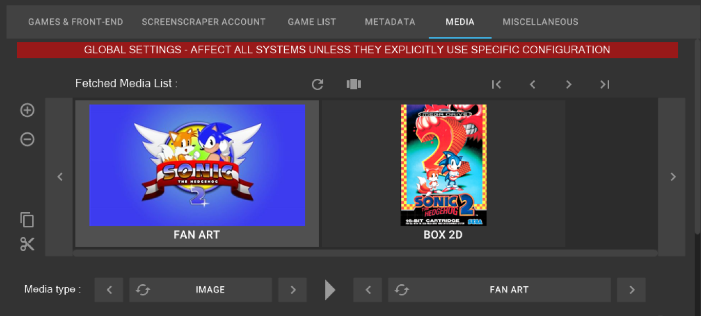
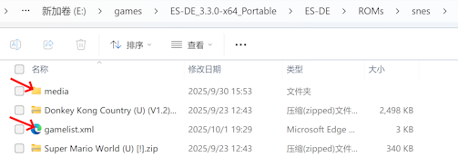

# 使用 gamelist.xml
## 基本使用
为了让本插件能够正确显示出游戏信息，需要在每个游戏平台对应的 ROM 目录下放置 gamelist.xml 文件。本插件没有自动搜刮功能，所以需要你通过在 PC 上搜刮好后再拷贝到 Kodi 所在设备上。

推荐下载 [Skraper](https://www.skraper.net/) 这款软件来搜刮游戏素材，下载后运行会显示初始化面板，推荐注册登陆 ScreenScraper 网站，以获得更高每日的搜刮额度：

点击下一步后，选择 RecalBox 这个游戏前端：

接着选择 ROMS 的根目录，此目录下包含各个平台的游戏 ROM 目录文件夹：

选择完成后，点击下一步，会弹出选择后搜刮的媒体文件存放目录：

至此初始化过程完成，会弹出主界面。主界面上的 `MEDIA` 标签页可以用来设置图片类型：

默认可以设置两张图，分别对应 xml 文件中的 `image` 和 `thumbnail` 标签。推荐第一张图选择横向图，第二张选择竖向图。选择的方法是，点击示例图，然后选择 `Media Type` 的大分类为 IMAGE，小分类可以选择 `FANART` `BOX2D` `TITLE SCREENSHOT` `SCREENSHOT` 等，其中 `BOX2D` 是竖向图。

主界面的右下角有一个类似播放的开始按钮，点击后开始搜刮：

由于要搜刮所有平台的信息，所以点击开始后，会弹出一个确认框，告诉我们搜刮过程可能会很慢，我们点击 OK 按钮即可：

开始搜刮后，会显示搜刮进度：

搜刮完成后，会播放完成音乐，并且右下侧的按钮，会变成 √ 号：

这时候进入任意搜刮后的平台目录，就会发现多了 gamelist.xml 文件和 media 文件夹。

