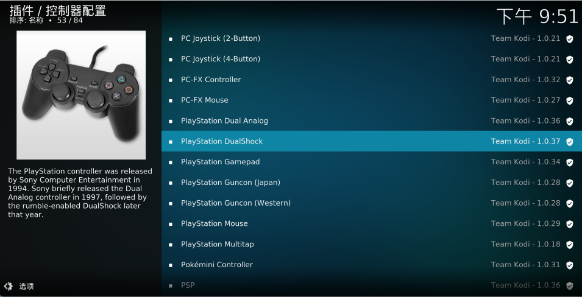
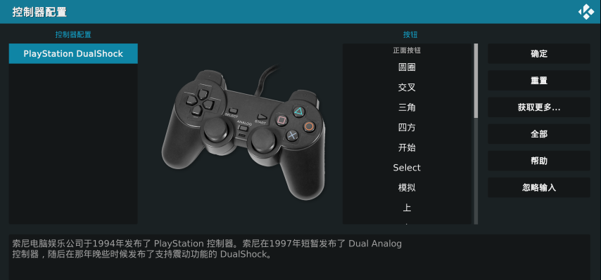

# Kodi 中如何添加游戏手柄
通过 `设置` -> `插件` -> `从库安装` -> `游戏插件` -> `控制器配置`，打开一系游戏机手柄列表，找到跟你手柄对应的选项，比如下面这款，点击安装。

安装完之后，点击插件的`设置`按钮，会弹出如下窗口：

窗口弹出后默认就让你设置`圆圈`键，点击手柄上的具体按键之后，就会让你设置`交叉`键，依次类推，设置完之后，点击保存按钮。如果设置过程中，某个按键你的手柄上没有对应按钮，可以长按任意键跳过。

设置完之后点击`保存`即可。

