# Game Visuals 使用手册

Game Visuals（游戏画廊）是一个 Kodi 视频插件。它读取 ROM 目录里的 `gamelist.xml`，把游戏的封面、截图、简介和片花展示出来，并通过 Kodi 自带的 RetroPlayer 启动游戏。

本手册的截图来自 Windows 版 Kodi 21，界面语言为简体中文，皮肤为默认的 Estuary。

- [准备工作](#准备工作)
- [添加游戏目录](#添加游戏目录)
- [插件设置](#插件设置)
- [Kodi 默认列表](#kodi-默认列表)
- [游戏详情页](#游戏详情页)
- [自定义浏览布局](#自定义浏览布局)
- [为游戏配置片花](#为游戏配置片花)
- [没有图片时的显示](#没有图片时的显示)
- [常见问题](#常见问题)

## 准备工作

1. **Kodi 19 或更高版本**。插件依赖 Kodi 自带的 RetroPlayer 运行游戏。
2. **游戏模拟器核心**。第一次启动某个平台的游戏时，Kodi 会提示选择并安装对应的模拟器核心（`game.libretro.*`），按提示安装即可，详见[启动游戏与模拟器](#启动游戏与模拟器)。
3. **gamelist.xml**。插件本身不会搜刮游戏信息，需要先在电脑上用 Skraper 等工具生成 `gamelist.xml` 和图片、视频素材，再放进 ROM 目录。具体步骤见[使用 gamelist.xml](gamelist-usage.md)。
4. **手柄**（可选）。手柄的按键映射见 [Kodi 中如何添加游戏手柄](how-add-joystick.md)。

## 添加游戏目录

从 Kodi 主界面进入 **插件 → 视频插件 → Game Visuals**，首页会列出已经添加的游戏目录：

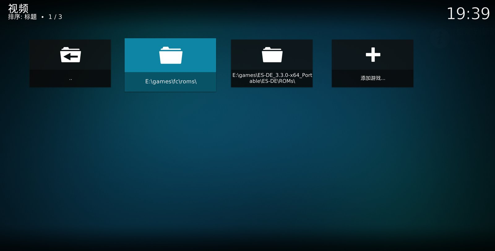

- **添加目录**：选择 **添加游戏...**，在弹出的文件浏览器里选择 ROM 目录。可以添加多个目录。
- **删除目录**：在目录上打开右键菜单（键盘 `C` 键，遥控器菜单键），选择 **删除**。
- **目录结构**：既可以直接选择某个平台的 ROM 目录，比如 `E:\games\fc\roms`，也可以选择包含多个平台子目录的根目录，比如 ES-DE 的 `ROMs` 目录。子目录如果按平台命名（`nes`、`snes`、`megadrive` 等），插件会显示平台的完整名称和图标。

## 插件设置

在 Kodi 的 **插件** 页面里选中 Game Visuals，打开右键菜单，选择 **设置**。

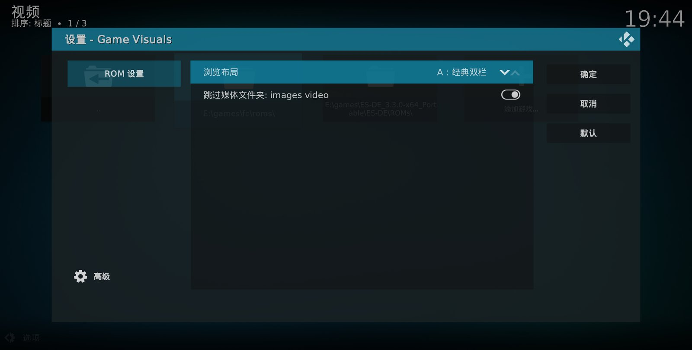

| 设置项 | 说明 |
|---|---|
| 浏览布局 | 打开游戏目录时使用的界面。可选 **Kodi 默认列表**、**A：经典双栏**、**B：沉浸式大图**、**C：海报墙**、**D：复古电视**，详见下文。默认为 Kodi 默认列表。 |
| 跳过媒体文件夹 | 开启后，ROM 目录里的 `images`、`videos`、`media` 等素材文件夹不会出现在游戏列表中。建议保持开启。 |

## Kodi 默认列表

「浏览布局」选择 **Kodi 默认列表** 时，游戏目录用 Kodi 皮肤自带的视图显示。左下角 **选项 → 视图类型** 可以切换列表、海报墙等皮肤提供的视图。

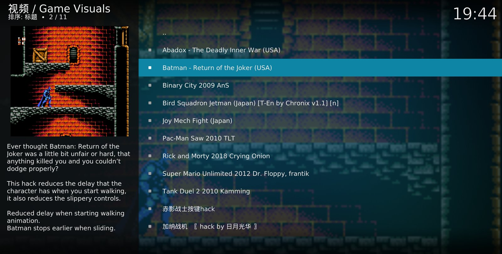

- **开始游戏**：选中游戏后按确认键。
- **查看详情**：在游戏上打开右键菜单，选择 **游戏详情**，打开插件自己的[游戏详情页](#游戏详情页)。

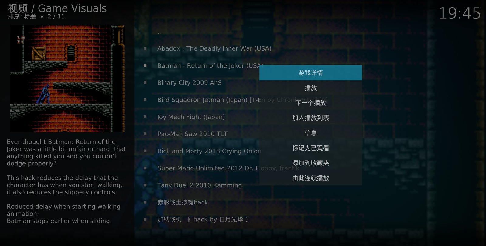

> 在默认列表里按 `I` 键（信息键）打开的是 Kodi 自带的信息页，不是插件的游戏详情页。要打开详情页，请使用右键菜单。

## 游戏详情页

详情页集中展示一款游戏的全部信息：

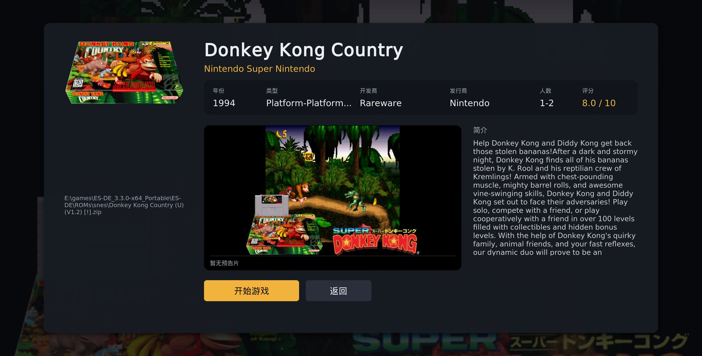

- **左侧**：封面和 ROM 文件路径。
- **标题下方**：平台名称，以及年份、类型、开发商、发行商、人数、评分。`gamelist.xml` 里没有填写的字段会自动隐藏；一项都没有时，显示「暂无更多信息」。
- **中部**：预告片区域。游戏配有片花时自动播放，下方显示播放进度；没有片花时显示截图。
- **右侧**：游戏简介，内容较长时会自动滚动。
- **底部按钮**：
  - **开始游戏**：停止片花，启动游戏。
  - **全屏预告**：全屏播放片花，按返回键回到详情页。只有配了片花的游戏才显示这个按钮。
  - **返回**：关闭详情页。

配有片花的游戏，打开详情页后会立即开始播放：

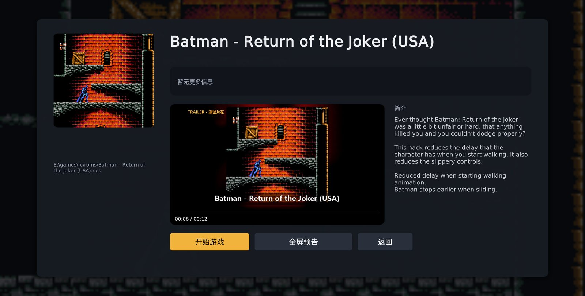

## 自定义浏览布局

「浏览布局」选择 A–D 中的任意一种后，在插件首页打开游戏目录，会进入对应的全屏界面。四种布局的操作方式完全相同：

| 按键（键盘 / 遥控器） | 作用 |
|---|---|
| 方向键 | 选择游戏或文件夹 |
| `Enter` / 确认键 | 进入文件夹，或开始游戏 |
| `I` / 信息键，`C` / 菜单键 | 打开[游戏详情页](#游戏详情页) |
| `Backspace`、`Esc` / 返回键 | 返回上一级文件夹，在最上层时关闭界面 |

选中一个配有片花的游戏，停留约 1.5 秒后，片花会在界面里的视频区域自动播放；移到其他游戏时自动停止。打开详情页、启动游戏时，片花也会自动停止。

### A：经典双栏

左侧是游戏列表，右侧上方是片花或截图，下方是封面、标题、标签和简介。适合游戏数量多、需要快速浏览的目录。

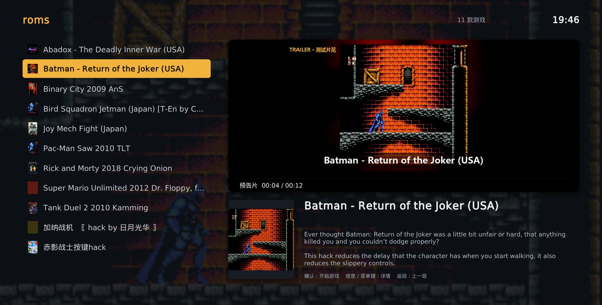

`gamelist.xml` 里的年份、类型、开发商、人数和评分，会显示成标题下方的一排标签，评分用琥珀色突出：

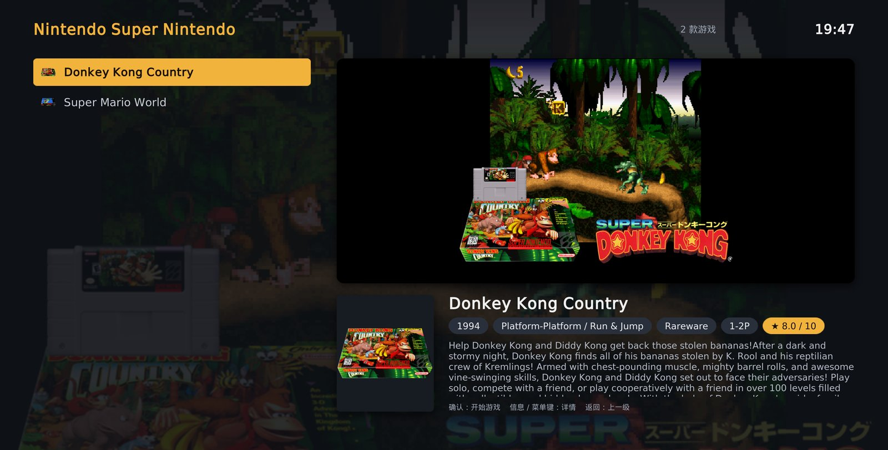

### B：沉浸式大图

当前游戏的截图铺满背景，左侧是大标题和简介，右上角播放片花，底部是可以左右滑动的封面轮播。适合在电视上使用。

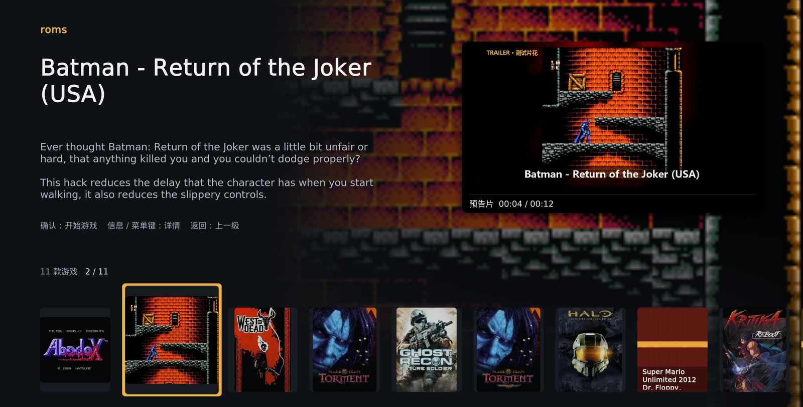

### C：海报墙

每行 7 个封面，用方向键在网格里移动，底部信息条显示当前游戏的小片花、标题和简介。适合封面齐全的目录。

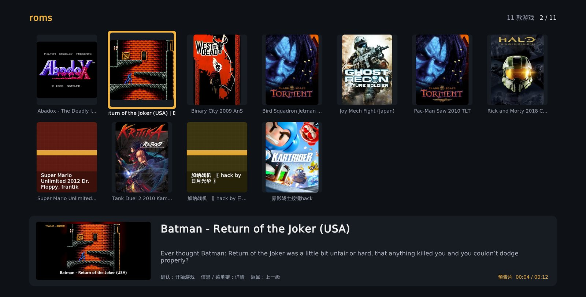

### D：复古电视

片花和截图在一台复古电视的屏幕里播放，带扫描线效果；右侧的游戏列表做成卡带样式。

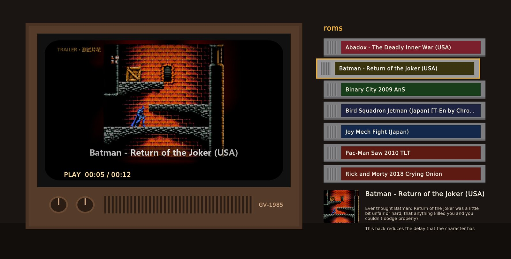

### 浏览多平台目录

如果添加的是包含多个平台子目录的根目录，平台文件夹会先用 Kodi 原生视图列出，显示平台图标和介绍。进入包含游戏的文件夹时才会打开布局，在布局里按返回键即可回到平台列表。

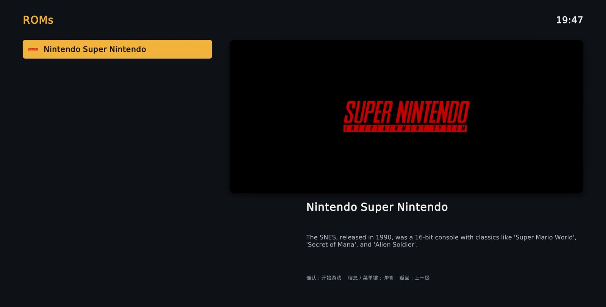

## 为游戏配置片花

片花通过 `gamelist.xml` 里每个 `<game>` 的 `<video>` 标签指定，路径相对于 `gamelist.xml` 所在的目录。下面是插件会读取的全部标签：

```xml
<game>
    <path>./Donkey Kong Country (U) (V1.2) [!].zip</path>
    <name>Donkey Kong Country</name>
    <desc>游戏简介……</desc>
    <image>./media/images/Donkey Kong Country (U) (V1.2) [!].png</image>       <!-- 截图，用作背景 -->
    <thumbnail>./media/box3d/Donkey Kong Country (U) (V1.2) [!].png</thumbnail> <!-- 封面 -->
    <video>./videos/Donkey Kong Country (U) (V1.2) [!].mp4</video>              <!-- 片花 -->
    <releasedate>19941125T000000</releasedate>  <!-- 取前 4 位作为年份 -->
    <genre>Platform</genre>
    <developer>Rareware</developer>
    <publisher>Nintendo</publisher>
    <players>1-2</players>
    <rating>0.8</rating>                        <!-- 0~1 的小数，显示为 8.0 / 10 -->
</game>
```

- 视频格式只要 Kodi 能播放即可，推荐 MP4（H.264）。
- 建议把片花放在 ROM 目录下的 `videos` 文件夹里。开启「跳过媒体文件夹」后，这个文件夹不会出现在游戏列表中。
- `<video>` 指向的文件不存在时，插件按没有片花处理。

## 没有图片时的显示

如果 `gamelist.xml` 里一款游戏既没有封面也没有截图，插件会用一张带游戏名的纯色卡片代替封面。同一个游戏在各个布局和详情页里，卡片颜色保持一致。截图区域会显示「暂无截图」，复古电视布局里则显示「NO SIGNAL」。

上面布局 C 的截图中，第二行的 Super Mario Unlimited 和加纳战机就是这种卡片。

## 启动游戏与模拟器

第一次启动某个平台的游戏时，Kodi 会弹出选择模拟器的对话框，列出所有支持这个文件格式的模拟器核心。已经安装的核心会有标注，可以直接使用；选择未安装的核心，Kodi 会先下载安装。

FC / NES 游戏推荐使用 **Nestopia** 或 **FCEUmm**。

## 常见问题

**安装模拟器核心时提示失败**

如果 `kodi.log` 里出现下载 404 错误，说明 Kodi 本地的插件库索引太旧，对应的旧版本已经从官方镜像上删除了。进入 **插件 → 从库安装 → Kodi Add-on repository**，在仓库上打开右键菜单，选择 **检查更新**，刷新后再安装。

**启动游戏后 Kodi 崩溃**

通常是模拟器核心不兼容这个 ROM。比如 bnes 核心比较老，运行部分自制游戏会崩溃。在 **插件 → 我的插件** 的游戏插件分类里找到出问题的模拟器核心，把它卸载，再换用其他核心。

**界面顶部显示的是文件夹名，而不是平台名**

插件根据文件夹名识别平台。把 ROM 文件夹按 EmulationStation 的平台目录名命名（例如 `nes`、`snes`、`megadrive`），就能显示完整的平台名称。

**片花不播放**

- 确认 `<video>` 的路径正确，并且文件存在。
- 确认在布局里选中游戏后停留了 1 秒以上。
- 确认这个视频能在 Kodi 里直接播放。

**更新插件后，界面上部分文字是空的**

插件新增的界面文字需要重启 Kodi 后才会加载。
